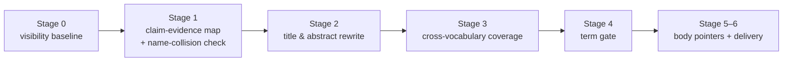

# Paper Title Optimizer

> Make your paper **findable and citable** by AI answer engines — ChatGPT, Perplexity, Google AI Overviews — and literature indexes (arXiv, Semantic Scholar).

**Paper Title Optimizer** is an [agent skill](https://github.com/anthropics/skills) (`SKILL.md` + scripts + data) for [Claude Code](https://claude.com/claude-code), Codex, and ZCode that rewrites **academic paper titles and abstracts** for the age of AI search. Think SEO, but for papers — the literature calls it **Generative Engine Optimization (GEO)** (KDD 2024). 论文标题/摘要的 AI 检索优化。

  

## One-step install — paste this to your agent

No terminal knowledge needed. Copy the block below, paste it into **Claude Code / Codex / ZCode** (or any agent that loads `SKILL.md` skills), press enter, done.

```text
Install the "paper-title-optimizer" agent skill from
https://github.com/Hoemr/paper-title-optimizer for me:

1. Fetch it: git clone --depth 1 https://github.com/Hoemr/paper-title-optimizer /tmp/paper-title-optimizer
   (if git is unavailable, download https://github.com/Hoemr/paper-title-optimizer/archive/refs/heads/main.tar.gz and extract it instead).
2. Copy SKILL.md, references/ and scripts/ from the downloaded folder into the skills
   directory you actually read: ~/.claude/skills/ (Claude Code), ~/.codex/skills/ (Codex),
   ~/.zcode/skills/ (ZCode), or ~/.cc-switch/skills/ if my skills are managed by cc-switch.
   Pick the one that matches your platform; if you can't tell, use ~/.claude/skills/.
3. Verify the scripts run: node <installed path>/scripts/title-stats.mjs --help
   (requires Node 18+; if Node is missing, still finish the install and tell me —
   the skill works without the scripts, they are only for data probes).
4. Report: where you installed it, and give me one example sentence that triggers it.
Do not ask me follow-up questions; just do it and report.
```

中文版（二选一即可）：

```text
帮我安装 agent skill "paper-title-optimizer"，来源：
https://github.com/Hoemr/paper-title-optimizer

1. 获取：git clone --depth 1 https://github.com/Hoemr/paper-title-optimizer /tmp/paper-title-optimizer
   （没有 git 就下载并解压 https://github.com/Hoemr/paper-title-optimizer/archive/refs/heads/main.tar.gz ）
2. 把其中的 SKILL.md、references/、scripts/ 复制到你实际读取的 skills 目录：
   ~/.claude/skills/（Claude Code）、~/.codex/skills/（Codex）、~/.zcode/skills/（ZCode）；
   如果我的 skills 由 cc-switch 管理（~/.cc-switch/skills/），装那里。
   分不清就用 ~/.claude/skills/。
3. 验证：node <安装路径>/scripts/title-stats.mjs --help 能正常运行
   （需要 Node 18+；没有 Node 也要完成安装并告诉我——脚本只是数据探针，不影响 skill 主体）。
4. 最后告诉我装到了哪里，并给我一句能触发它的话。
不要向我提问，直接做完汇报。
```

Prefer manual? See [Install manually](#install-manually).

## Why

Reviewers are no longer the only readers of your title and abstract. When a researcher asks ChatGPT or Perplexity *"which paper should I read about X?"*, the answer is assembled by **lifting whole sentences** out of titles, abstracts, and related work. A title written only for a 2015-style human skimmer is invisible to that pipeline:

- AI engines retrieve by **semantic match against queries researchers actually type** — not by the internal jargon your paper coins.
- The GEO paper (KDD 2024) measured what moves the needle: **quoting +40%, statistics +30%, fluent readable prose +15–30% — and keyword stuffing is the only measured-harmful tactic.**
- Title/abstract are the only fields indexed by arXiv, Semantic Scholar, OpenAlex, and Crossref. If the word isn't there, the paper doesn't exist for that query.

## What the skill does



1. **Stage 0 — Visibility baseline.** Before touching anything, probe whether 8–12 queries can actually retrieve your paper (arXiv backend built in; ChatGPT/Perplexity optional via API keys). No baseline, no way to tell better from worse later.
2. **Stage 1 — Claim→evidence map.** Every number in a rewrite must point to a table/section in the manuscript; missing ones are marked `[待补]`, never guessed. Includes **method-name collision checks** against the arXiv corpus (a colliding acronym makes AI confuse your results with someone else's).
3. **Stage 2 — Title & abstract rewrite (L1).** 2–3 title variants with explicit trade-offs; abstract rebuilt sentence-by-sentence for self-contained quotability.
4. **Stage 3 — Cross-community coverage (L2).** 8–12 queries written by *outsiders who don't know your jargon*, matched against the abstract in a hit/partial/miss matrix; capped at three vocabulary spaces so reviewers still know which community you belong to.
5. **Stage 4 — Term gate (L3).** Trending terms must pass four gates (real relationship, rising phase, not peaked, annualized data) before entering your abstract; rejected terms are reported with reasons, never silently dropped.
6. **Stage 5+6 — Body pointers & delivery.** Location-level suggestions for the manuscript body (never full rewrites), then a 9-item output contract.

### Example

```text
Before  Towards Robust Retrieval-Augmented Generation: A Comprehensive Study
        of Adaptive Decomposition Techniques
After   Adaptive Query Decomposition for Multi-Hop RAG: +23 Accuracy Points
        Across 6 Benchmarks and 3 LLM Families
```

Method name, task name, magnitude, and evaluation breadth are all in one paste-able sentence. (This is the "conclusion-first" template — one of four. Whether a title should carry a number at all is decided by the evidence rules below, not by default.)

## Evidence-based, with receipts

Most "optimization" advice is folklore. This skill ships its own data: `scripts/title-stats.mjs` analyzed **16,677 accepted titles** from ICLR 2025, NeurIPS 2024, ICML 2024, ACL 2025, and CVPR 2024 (via [papercopilot/paperlists](https://github.com/papercopilot/paperlists)). Findings baked into the rules:

- Only **1.8–2.8%** of accepted titles carry a quantitative number — numbers are a *differentiation* move, not a default.
- **Decimal percentages are near-extinct** in accepted titles (two-decimal cases: **0** across five conferences). Write `half the memory`, not `48.6% less memory`; keep the exact value for the abstract.
- Oral/award papers carry numbers 1.5–2.3× more often than posters — consistent with strong results enabling numbers, not numbers buying citations (selection effect, stated honestly).
- Accepted-title phrase pool (`references/title-word-pool.csv`) seeds subtitle word choices with real community vocabulary.

Every conclusion is reproducible: `node scripts/title-stats.mjs <venue-year>.json` on any year's data.

## Install manually

```bash
# Claude Code
mkdir -p ~/.claude/skills && cp -r paper-title-optimizer ~/.claude/skills/

# Codex
mkdir -p ~/.codex/skills && cp -r paper-title-optimizer ~/.codex/skills/

# ZCode
mkdir -p ~/.zcode/skills && cp -r paper-title-optimizer ~/.zcode/skills/

# cc-switch
cp -r paper-title-optimizer ~/.cc-switch/skills/

# Or drop the folder into your agent workspace's .skills/ directory
```

Scripts need Node 18+ (no third-party dependencies). `OPENAI_API_KEY` / `PERPLEXITY_API_KEY` are optional — without them the visibility probe reports `skipped` ("not measured" ≠ 0) instead of fabricating data.

## Usage

Just ask in natural language; the skill triggers on:

- "优化我的论文标题" / "摘要改写" / "让 ChatGPT 引用我的论文" / "论文标题太长/太空"
- "abstract rewrite" / "paper title optimization" / "make my paper findable in AI search"
- "GEO for papers" / "arXiv abstract SEO" / "how do I get my paper cited by AI"
- "check if my method name is taken"

## FAQ

**Will this make ChatGPT cite my paper?**
No one can promise that. It raises the *probability* of being retrieved and quoted; real effects take 3–9 months to observe. The skill refuses to inflate claims or stuff keywords (the one tactic measured to hurt), and says "this paper needs another experiment" when evidence is short.

**Can I use it for my thesis / a journal paper / a non-English paper?**
Yes. Venue rules set abstract length and anonymization requirements (the skill asks for your venue). The term pool and title statistics are English/CS-top-conference data — treat them as reference, not law, outside that scope.

**How is this different from just asking ChatGPT to "improve my title"?**
A chat answer optimizes for reading flow. This skill optimizes for the *retrieval pipeline*: baseline before/after measurement, evidence mapping so no number is invented, cross-vocabulary coverage so neighboring communities can find you, name-collision checks, and conference-data-backed rules.

**Does my paper leave my machine?**
The skill and scripts run locally. Network calls: arXiv's public API (trend probes, collision checks) and — only if you set the keys yourself — OpenAI/Perplexity APIs for visibility probes. Nothing else is uploaded.

## Repository layout

```
paper-title-optimizer/
├── SKILL.md                     # six-stage procedure + five hard constraints
├── references/
│   ├── title-patterns.md        # L1 title rules (structure, first words, colons, numbers)
│   ├── title-numbers.md         # empirical study: numbers in 16,677 accepted titles
│   ├── title-numbers-stats.json # the data snapshot behind the study
│   ├── title-word-pool.csv      # accepted-title phrase pool (per-10k frequencies)
│   ├── abstract-architecture.md # sentence-position template for quotable abstracts
│   ├── layer2-coverage.md       # cross-vocabulary query coverage method
│   ├── layer3-terms.md          # term-gate rules + term pool schema
│   ├── constraints.md           # the five non-negotiables, with rationale
│   └── term-pool.csv            # arXiv trend seed pool (demo; probe refreshes live)
├── scripts/
│   ├── arxiv-trend.mjs          # per-year arXiv phrase counts, rising/peaked/stale classification
│   ├── visibility-probe.mjs     # baseline: can 8–12 queries retrieve this paper?
│   └── title-stats.mjs          # reproduce the title-number study on any paperlists file
└── LICENSE
```

## Honest boundaries

This skill improves the *probability* of being retrieved and quoted; it does not guarantee citations, and it will tell you so. It refuses to fabricate numbers, inflate claims, or stuff keywords (the one tactic measured to hurt). If a target requires a stronger claim than the evidence supports, the correct output is *"this paper needs another experiment"* — not a snappier title.

## 中文说明

一个给 Claude Code / Codex / ZCode 用的论文标题与摘要优化 skill：把已完成的论文改写成在 AI 检索管道（ChatGPT、Perplexity、Google AI Overviews）和文献索引（arXiv、Semantic Scholar）里容易被召回、被整句引用的版本。把 README 顶部的**一键安装 prompt** 粘贴给你的 agent 即可完成安装，无需命令行经验。内置六阶段流程（可见度基线 → 证据映射 → 标题摘要改写 → 跨词汇覆盖 → 术语闸门 → 交付）和五条硬约束（不编数字、不抬 claim、不挂无关热词、正文只给定位建议、没测到就说没测到）。规则不是拍脑袋：分析了五大会 16,677 篇录用标题后写成的，全部可复现。

## License

MIT — see [LICENSE](LICENSE).
